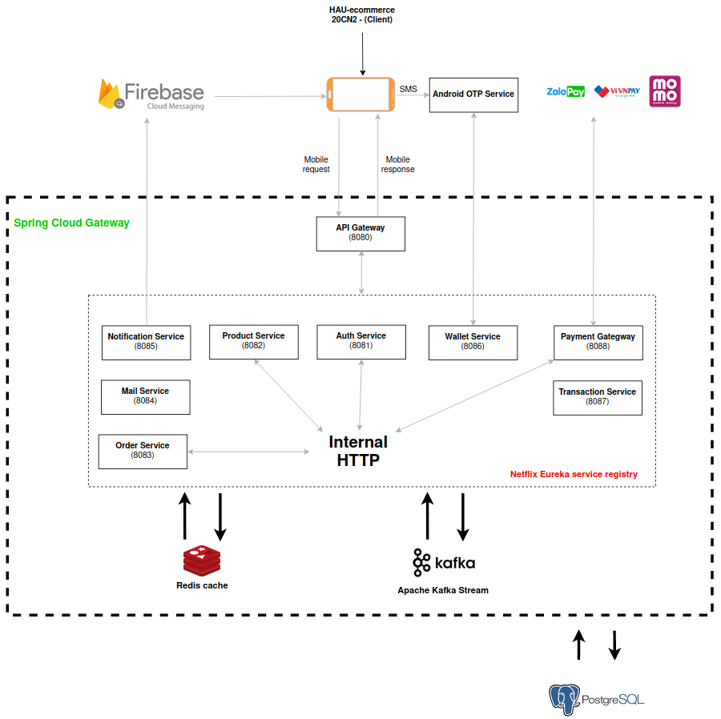

## Hau-Ecommerce
- Backend module for the final project of the Ecommerce System Development course
- [App mobile source](https://github.com/yosefPham/e-commerce-app/tree/huy_2405)
- [SMS Receiver Android app](https://drive.google.com/file/d/1Dhik-WqprDjZOlb5sG2dkG175M8XLjUS/view?usp=sharing) [[Source code](https://github.com/cuonvc/sms-receiver)] - Catching SMS balance change messages from the bank and sending requests to the server
#### 20CN2 - Hanoi Architectural University

### Application architecture diagram

### How to pull and start the backend module

#### 1. Install Docker and Docker-compose
- [On Ubuntu](https://www.digitalocean.com/community/tutorials/how-to-install-and-use-docker-on-ubuntu-20-04)
- [On Windows](https://docs.docker.com/desktop/install/windows-install/#install-docker-desktop-on-windows)
#### 2. Pulling and starting the backend service
- Include the logs to monitoring
```
docker-compose up
```
- Or do not include the logs
```
docker-compose up -d
```
...
